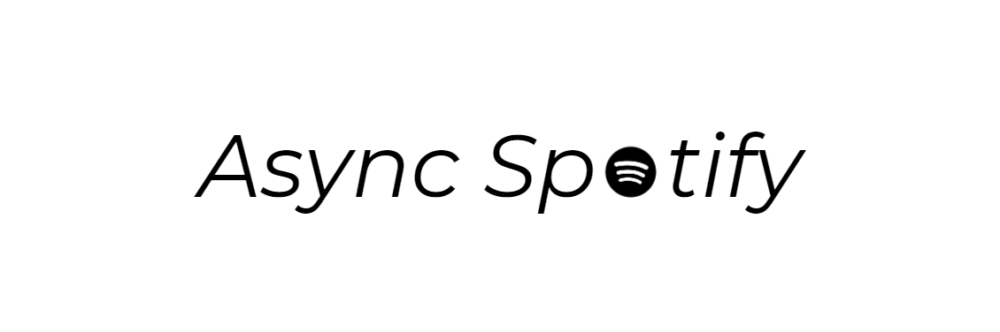

# AsyncSpotify


[](https://app.codacy.com/manual/nhaderer1/AsyncSpotify?utm_source=github.com&utm_medium=referral&utm_content=HuiiBuh/AsyncSpotify&utm_campaign=Badge_Grade_Dashboard)
[](https://codecov.io/gh/HuiiBuh/AsyncSpotify)

## Documentation

The full documentation can be viewed [here](https://huiibuh.github.io/AsyncSpotify/).

## Why should you use this library

+ 100% Code coverage
+ Completely type annotated
+ Completely async
+ Scales up to (theoretically) unlimited requests per second (tested with 1000 simultaneous requests which lead to a 429)
+ Customize the timeout, maximal simultaneous request
+ Throws custom errors, so you can catch different errors easily
      + Token expiration
      + Rate limit violation
      + An invalid album id
+ Gets rid of the client credential workflow if you provide spotify cookies
    + Good for automated testing
+ Offers a hook which gets called if the token expires, so you can automatically update the token

## Installation

You need at least python3.6 to install the package

```bash
pip install async-spotify
```

## Example

For more in depth examples take a look [here](https://huiibuh.github.io/AsyncSpotify/EXAMPLES/) or visit the documentation.

```python
from async_spotify import SpotifyApiClient
from async_spotify.authentification import SpotifyAuthorisationToken
from async_spotify.authentification.authorization_flows import AuthorizationCodeFlow
# Create a auth_code_flow object and load the auth_code_flow from env variables
auth_flow = AuthorizationCodeFlow()
auth_flow.load_from_env()

# Create a new Api client and pass the auth_code_flow
api = SpotifyApiClient(auth_flow, hold_authentication=True)

# Get the auth token with your code
code: str = "Your Spotify Code"
auth_token: SpotifyAuthorisationToken = await api.get_auth_token_with_code(code)

# Create a new client
await api.create_new_client(request_limit=1500)

# Start making queries with the internally saved token
album_tracks: dict = await api.albums.get_tracks('03dlqdFWY9gwJxGl3AREVy')

# If you pass a valid auth_token this auth_token will be used for making the requests
album_tracks: dict = await api.albums.get_tracks('03dlqdFWY9gwJxGl3AREVy', auth_token)
```

## Tests

See [here](STUFF.md).
